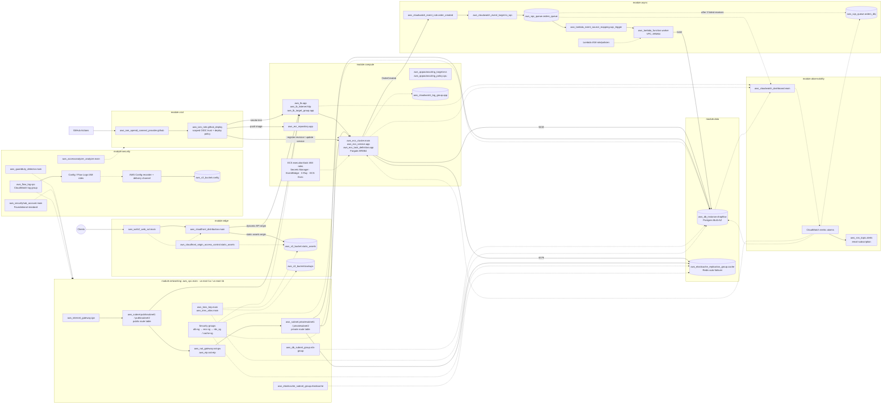

# Terraform Resource Architecture

This diagram shows the main AWS resources created by the `terraform/environments/dev` root module and the traffic, event, deployment, observability, and security relationships between them.

## Terraform Module Boundaries

| Module | Primary resources |
| --- | --- |
| `networking` | VPC, public/private subnets, routes, NAT gateway, security groups, subnet groups, KMS key |
| `data` | Multi-AZ RDS PostgreSQL and ElastiCache Redis |
| `compute` | ECR, ALB, ECS Fargate service/task definition, autoscaling, logs, IAM |
| `async` | EventBridge, SQS queue/DLQ, Lambda worker, event source mapping, IAM |
| `edge` | CloudFront, WAF, static-assets and backup S3 buckets, OAC, KMS policy |
| `cicd` | GitHub OIDC provider and scoped deployment role |
| `observability` | CloudWatch dashboard, alarms, SNS topic and email subscription |
| `security` | GuardDuty, Security Hub, AWS Config, Access Analyzer, VPC Flow Logs |
